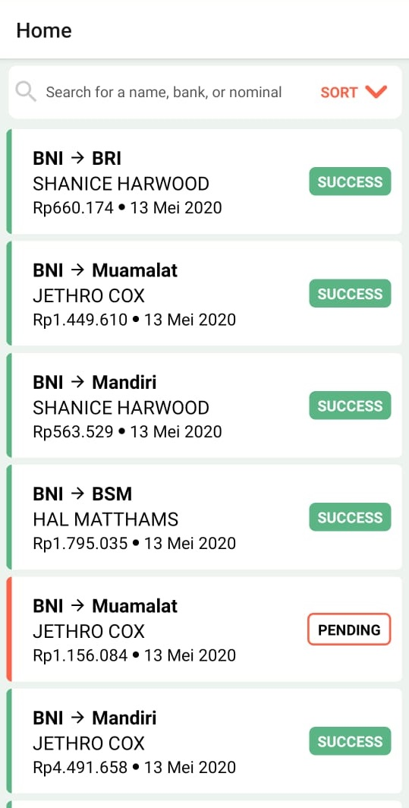
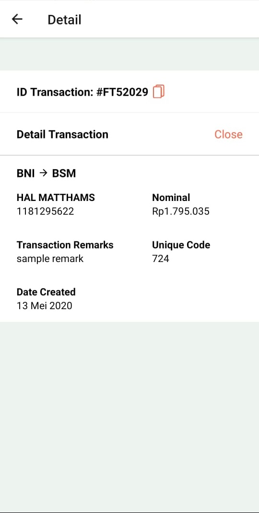

<p align="center">
  
</p>

<p float="left">
  <a href="https://github.com/facebook/react-native/blob/master/LICENSE">
    
  </a>
  <a href="https://circleci.com/gh/facebook/react-native">
    
  </a>
  <a href="https://www.npmjs.org/package/react-native">
    
  </a>
  <a href="https://reactnative.dev/docs/contributing">
    
  </a>
</p>

# RN-TransactionApps
<p align="center">
  
   
</p>


## Introducing
React native transaction Apps


## Requirements

### Mandatory
- [Android Studio](https://developer.android.com/studio/index.html).
- [Node](https://nodejs.org), [Watchman](https://facebook.github.io/watchman/) and [React Native](https://facebook.github.io/react-native/).

### Optional
- [VS Code](https://code.visualstudio.com/)
- [Prettier](https://marketplace.visualstudio.com/items?itemName=esbenp.prettier-vscode)

## Enviroment Settings

### Mandatory
- Install [Android Studio](https://developer.android.com/studio/index.html) and create an emulator.
- Install [Node](https://nodejs.org), [Watchman](https://facebook.github.io/watchman/) and [React Native](https://facebook.github.io/react-native/).


## Steps to Run
### 1. Clone project and install the dependencies
```
git clone git@github.com:rifkiandriyanto/RN-TransactionApps.git && cd RN-TransactionApps && npm install
```

### 2. Make sure you have started an emulator and run the app on Android
```
npx react-native run-android
```

## Credits

- [Rifki Andriyanto](https://github.com/rifkiandriyanto)
